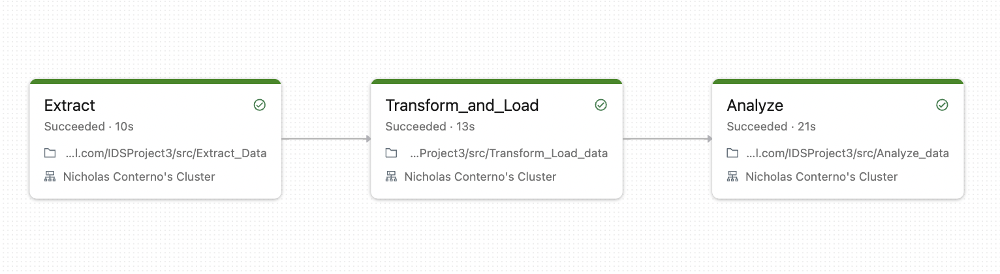
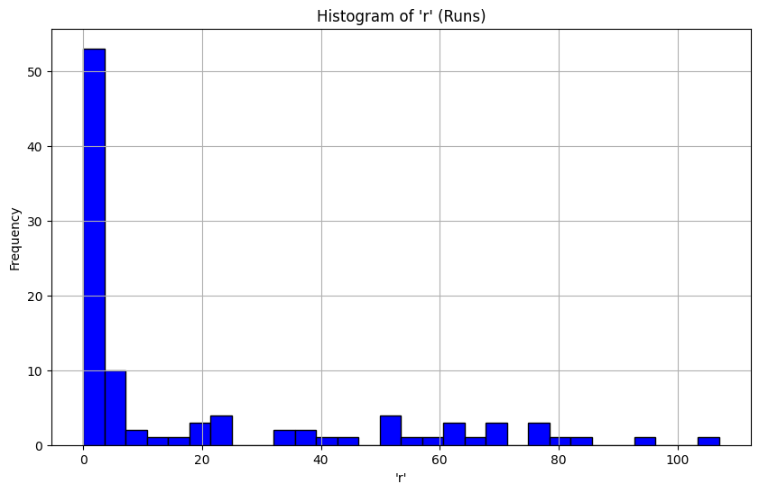
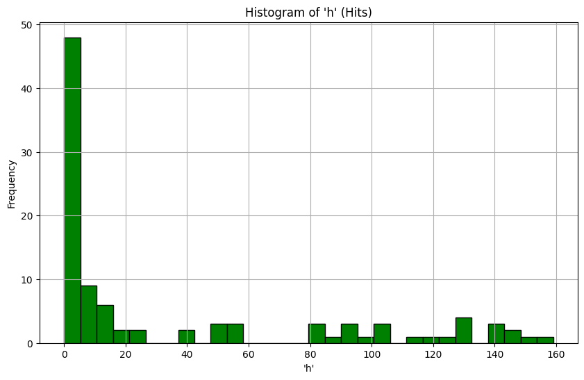
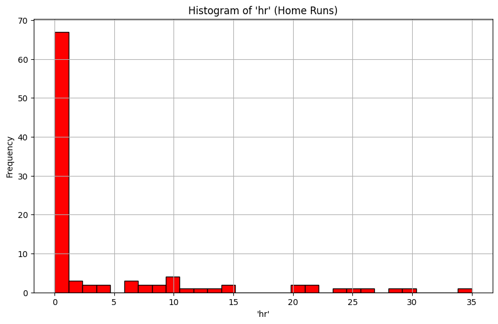

[](https://github.com/nicholasconterno/IDSProject3/actions/workflows/python-package.yml)
# Databricks ETL Pipeline Project README

## Overview
This README outlines a Databricks ETL (Extract, Transform, Load) pipeline project, showcasing the integration of Delta Lake for enhanced data management and storage. The pipeline focuses on extracting baseball data, transforming it via Spark SQL, and loading it into Delta Lake, enhancing data integrity and providing actionable insights through detailed analysis and visualizations.
## Makefile Usage

Our `Makefile` contains several rules to simplify the development process: 

- **install**:  Installs the necessary dependencies from the `requirements.txt` file.
- **lint**: Runs `flake8` to lint the code inside the `src` directory.
- **test**: Executes unit tests using `pytest`.

To use the Makefile:

### Installing Dependencies

This will install all required packages from `requirements.txt`:

```bash
make install
```

### Linting the Code

To check the code quality and maintain coding standards, run:

```bash
make lint
```

### Running Tests

To execute unit tests:

```bash
make test
```
### Running the Code

To run our pipeline you can run main.py or alternatively just run the following command:

```bash
make run
```


## Pipeline Stages

### Extract Operation
- **Source Data Extraction:** The pipeline begins by fetching baseball statistics from an external CSV file, as demonstrated in the snippet below:
  ```python
  csv_url = 'https://raw.githubusercontent.com/pandas-dev/pandas/main/doc/data/baseball.csv'
  response = requests.get(csv_url)
  pd_df = pd.read_csv(StringIO(response.text))
  ```
  This extraction process ensures a reliable and consistent data source for the pipeline.

### Transform Operation
- **Data Transformation with Spark SQL:** The extracted data undergoes a series of transformations using Spark SQL, highlighting the pipeline's capability to efficiently manage and manipulate large datasets. For instance:
  ```python
  df = spark.createDataFrame(pd_df)
  df = df.withColumn("year", col("year").cast("integer"))
  ```
  These transformations optimize the data for subsequent analysis and storage.

### Load Operation
- **Loading into Delta Lake:** The transformed data is loaded into Delta Lake, showcasing its superiority over traditional data lakes:
  ```python
  df.write.format("delta").mode("overwrite").save(delta_table_path)
  ```
  This step signifies the transition to a more robust and feature-rich data storage solution.

## Utilization of Delta Lake
- **Delta Lake Setup and Usage:** The project adeptly sets up Delta Lake, highlighting its advanced features. Delta Lake offers ACID transactions, scalable metadata handling, and time travel capabilities. For example, time travel allows querying previous versions of the data, which is invaluable for data auditing and rollbacks.

  ```python
  df.write.format("delta").mode("overwrite").save(delta_table_path)
  ```
  This code demonstrates the ease of writing to a Delta table, a core feature of Delta Lake that aids in maintaining data consistency and integrity.

### Data Validation Checks
- **Ensuring Data Quality:** The notebooks implement data validation checks, critical for maintaining high data quality. These checks ensure that the data frames are populated and correctly structured before further processing:
  ```python
  if original_df.rdd.isEmpty():
      raise ValueError("The DataFrame is empty. Check your data source.")
  ```

## Spark SQL in the Pipeline
- **Effective Use of Spark SQL:** The pipeline leverages Spark SQL to perform complex data transformations, demonstrating its ability to handle large-scale data operations within the Spark ecosystem. The transformations ensure that the data is clean and analysis-ready.

```python
# Using Spark SQL to transform the data
    transformed_df = spark.sql("""
        SELECT
            CAST(id AS INTEGER) AS id,
            player,
            CAST(year AS INTEGER) AS year,
            CAST(stint AS INTEGER) AS stint,
            team,
            lg
        FROM original_data
    """)

```

### Visualization and Conclusion
- **Data Visualization:** The project includes matplotlib visualizations to convey the analysis results effectively. For instance, histograms are plotted to show the distribution of runs, hits, and home runs, providing clear insights into player performances. The results are shown below: 



Player(s) with the most 'r':\
+---------+---+\
|   player|  r|\
+---------+---+\
|sheffga01|107|\
|gonzalu01| 93|\
|ramirma02| 84|\
|thomeji01| 79|\
| kentje01| 78|\
+---------+---+

Player(s) with the most 'h':\
+---------+---+\
|   player|  h|\
+---------+---+\
|gonzalu01|159|\
| kentje01|149|\
|thomafr04|147|\
|griffke02|146|\
|ramirma02|143|\
+---------+---+

Player(s) with the most 'hr':\
+---------+---+\
|   player| hr|\
+---------+---+\
|thomeji01| 35|\
|griffke02| 30|\
|bondsba01| 28|\
|thomafr04| 26|\
|sheffga01| 25|\
+---------+---+\

- **Actionable Recommendations:** The pipeline culminates in providing actionable recommendations based on the analysis. These recommendations are derived from player performance metrics and game statistics, aiding management in making informed decisions. My recommendations are to Make sure to keep players who excel in any of the three stats of home runs, hits, or runs because they are correlated, and players with high values for any of these statistics are extremely rare. 

## Automated Trigger
- **Automation of Pipeline Trigger:** The project incorporates an automated trigger through GitHub Actions, demonstrating an automated and efficient workflow. This trigger initiates the pipeline on events like push or pull requests on the main branch:
  ```yaml
  on:
    push:
      branches: [ main ]
    pull_request:
      branches: [ main ]
  ```

### Conclusion
This ETL pipeline project effectively demonstrates the integration of various technologies like Databricks, Delta Lake, and Spark SQL. The use of Delta Lake, in particular, brings significant enhancements in terms of data consistency, reliability, and advanced features like time travel and ACID transactions, proving crucial for robust data management and insightful analysis.